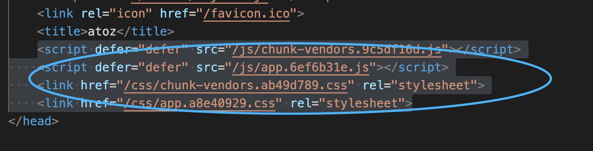
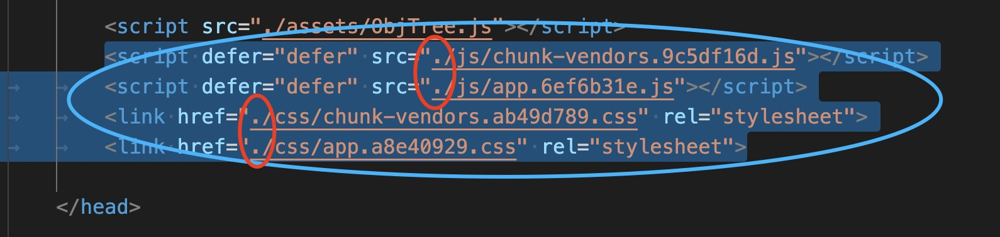
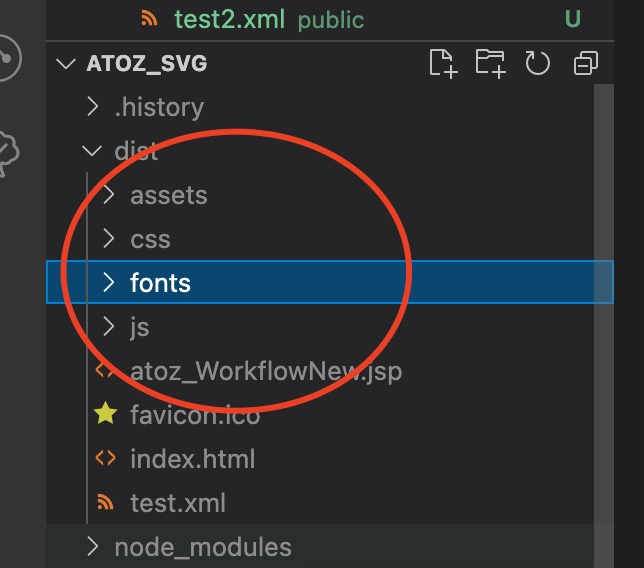

# atoz

## Project setup
```
npm install
```

### Compiles and hot-reloads for development
```
npm run serve
```

### Compiles and minifies for production
```
npm run build
```

### Lints and fixes files
```
npm run lint
```
### 构建部署步骤

npm run build
产物位置 /dist
拷贝index.html里面的script 到 atoz_WorkflowNew



修改为相对路径在引用前面加 .


然后ftp服务上传js css  assets文件夹 jsp文件



